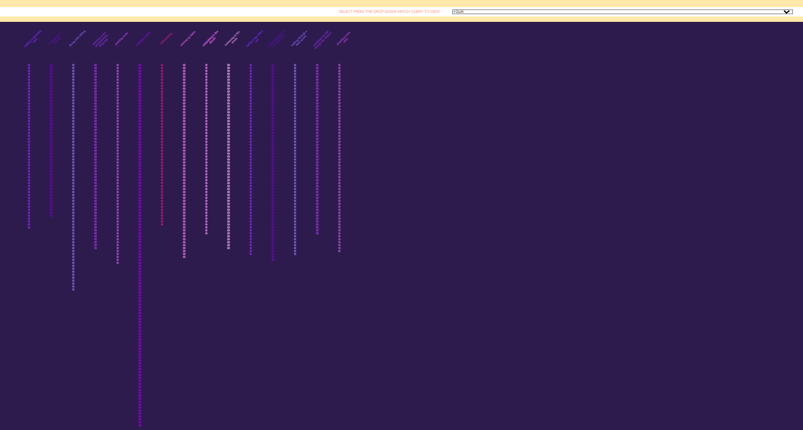
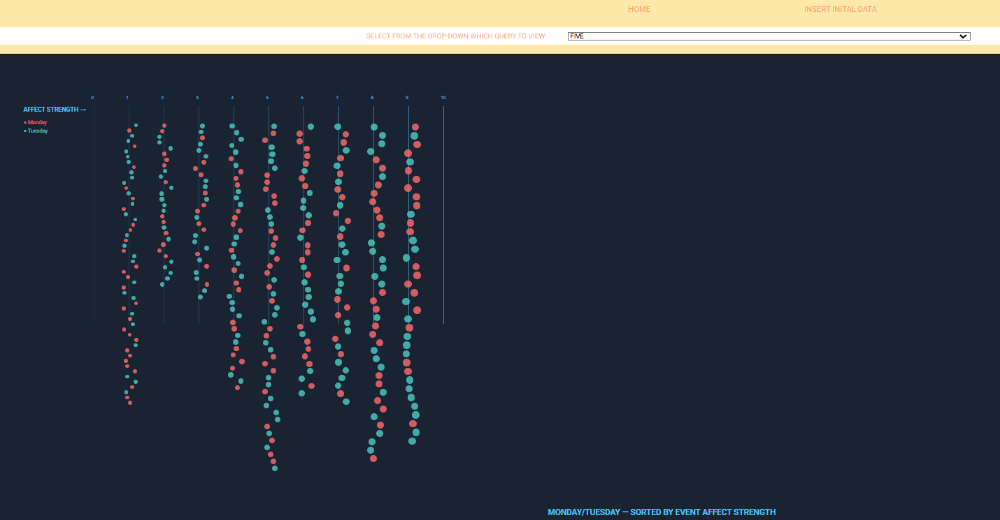
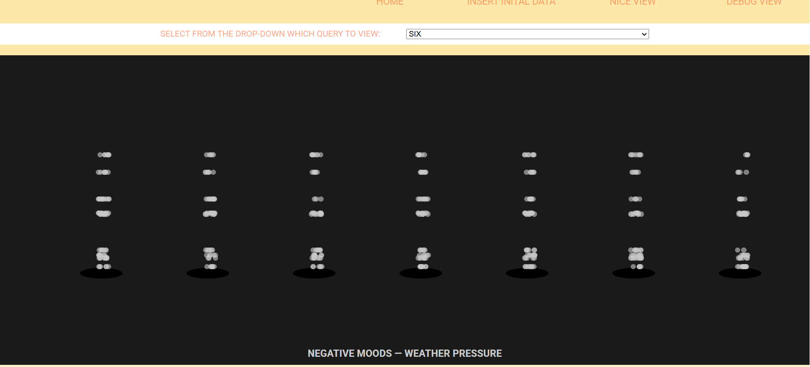

QUERY THREE

The bubbles represent the positive, flowy emotions. Every circle represents a person's positive mood. The bigger the bubble the stronger the after_mood strength was. I wanted to keep it light and fun to watch as the bubbles show up.

This query filters the database to check where the after_mood is a positive emotion. It returns all documents where the person's mood after an event is positive.

QUERY FOUR

It uses a ```find()``` to get all documents in the collection. It uses ```.sort({event_name:1})``` to sort the values alphabetically by the event_name field. Lastly I return the list in the results. This query organizes the data by the event type.

I wanted to represent a more "literal"/mathematical data visualization. This visualization shows vertical columns, one for each event type, going downward like a waterfall. Each column's height represents how frequently that event appears in the data. The purple gradient colors help distinguish between different event categories.


QUERY FIVE

It uses ```$in``` operator to filter for only Monday or Tuesday entries. It then uses ```.sort({event_affect_strength:1})``` to arrange results from lowest to highest impact. This query examines whether the beginning of the work week shows different patterns in how strongly events affect mood. It returns a subset focused on early-week emotional patterns.

Again, I wanted to represent a more "literal"/mathematical data visualization. The visualization displays a horizontal strength meter from 0-10 showing event affect strength. Data points are arranged vertically at their corresponding strength level, with red representing Monday and turquoise representing Tuesday. The size of each circle increases with its strength value. This visualization reveals whether Mondays or Tuesdays tend toward more impactful events.

QUERY SIX

For this query I had to check where both ```start_mood``` and ```after_mood``` were negative emotions. The results were sorted alphabetically by weather type using ```.sort({weather:1})```. This query identifies entries where mood was negative throughout the event period. It helps reveal if certain weather conditions affect negative moods.

I wanted to recreate a geyser for this query. Anger in cartoons is sometimes represented by steam/fuming, so I was inspired to make a geyser to represent negative emotions being released.  The visualization shows weather groups as steam vents with gray particles rising from black holes at the base. Each vent represents a different weather condition, and particles rise at speeds proportional to the ```after_mood_strength```.
